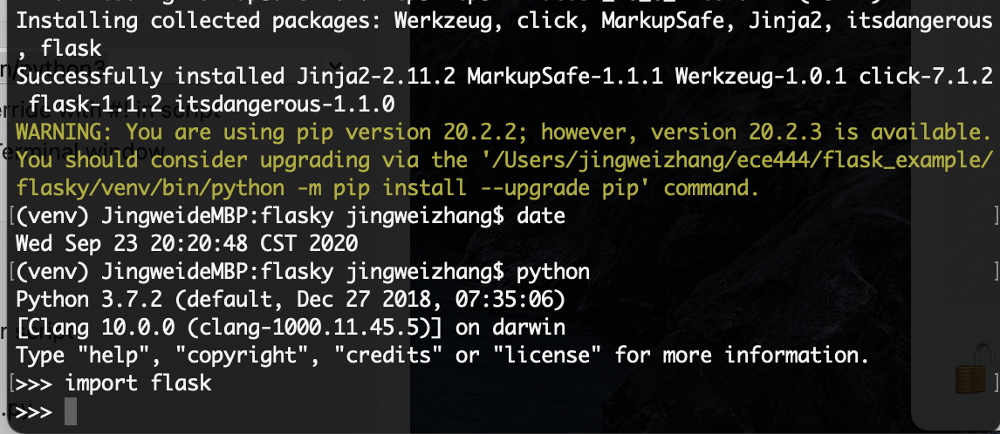
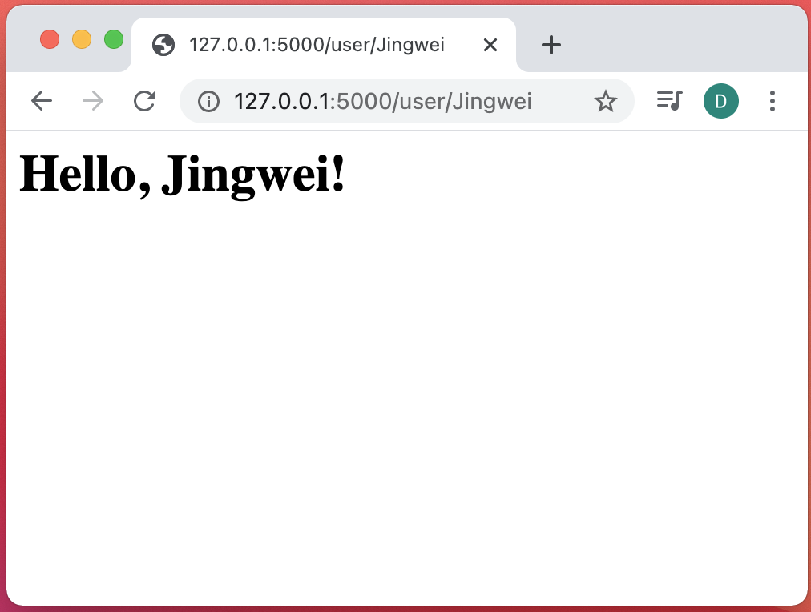

# Jingwei Zhang : this repo is a clone of : https://github.com/miguelgrinberg/flasky
Screenshot1 showing the successful installation:

Screenshot2 showing the hello world page with my name:

Answer to activity3: In this lab, we learnt that the context globals is a mechanism that flask uses to handle http request. It uses contexts to temporarily make certain objects globally accessible. 

